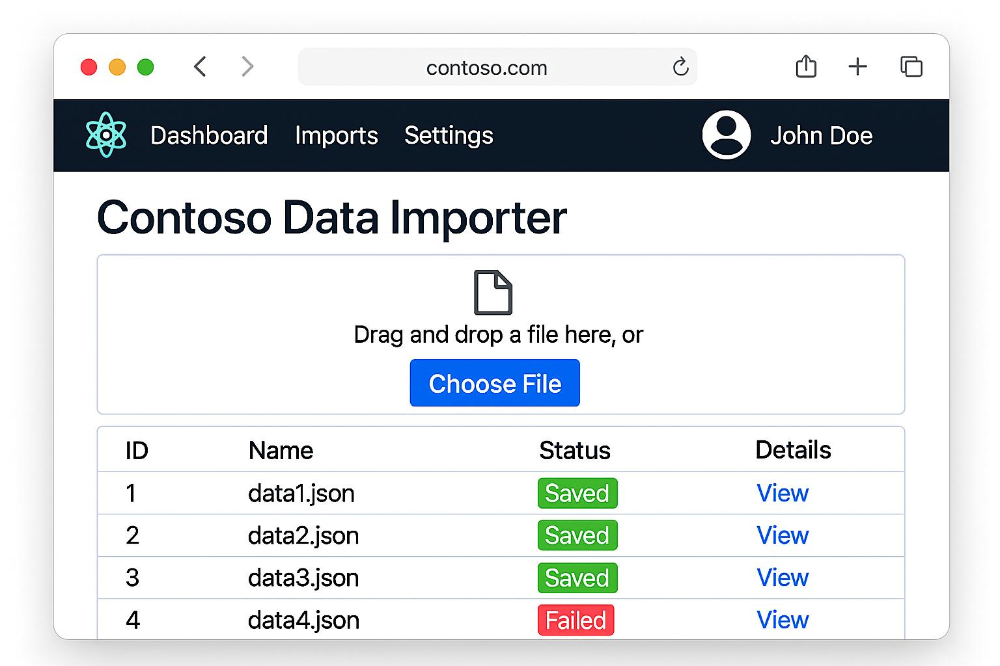

# Contoso Data Importer Demo

## Overview
This repository captures a multi-agent GitHub Copilot Chat walkthrough that transforms a UI mockup into a React-based experience. Each interaction uses specialized custom chat modes to showcase how orchestrated agents can design, implement, and validate an application from a single UI mockup (shown below and stored in `docs/contoso-importer-mockup.jpg`).

## Multi-Agent Workflow
The demo can be replayed by reenacting the prompts stored under `.github/prompts/`:
- `create-ai-agents.prompt.md` seeds the custom chat modes required for the scenario.
- `create-ui.prompt.md` drives the UI-centered workflow that the orchestrator and downstream agents consume.

### Orchestration Phases
1. **Agent Creation** – Run the `create-ai-agents` prompt to scaffold tailored chat modes for orchestration, development, and QA.
2. **Implementation Planning** – In the AI Orchestrator chat mode, execute “Analyze `create-ui.prompt.md` and coordinate an implementation plan” to produce the build roadmap.
3. **UI Development** – Switch to the Developer chat mode with “Implement React UI based on orchestrator's plan” to generate the user interface assets.
4. **Quality Validation** – In the QA Analyst chat mode, run “Test and validate implementation.”
5. **Final Coordination** – Ask the AI Orchestrator to perform “Final coordination and completion validation” to consolidate the outcome.

## Using Branch Checkpoints
Branch snapshots document each phase in sequence: `main`, `agents`, `implementation-plan`, `code`, and `tests`. They are intentionally provided as optional starting points when time constraints make it impractical to regenerate every artifact live. For a full end-to-end demo, begin on `main` and reproduce the workflow with the prompts above. When a shorter session is needed, jump to the branch that best represents the stage you want to highlight and resume the story from there.

## Demo Tips
- Show how the orchestrator prompt produces a plan that downstream agents follow, underscoring the coordination benefits of custom chat modes.
- Compare the generated artifacts between branches to illustrate incremental progress and agent collaboration.
- Emphasize that only the mockup image lives in `docs/`, reinforcing that all other assets are generated in response to the guided multi-agent dialogue.

